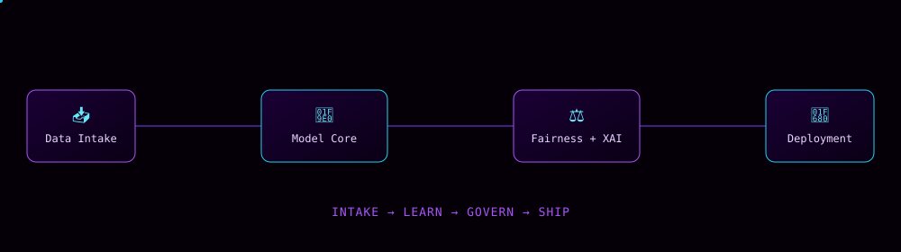
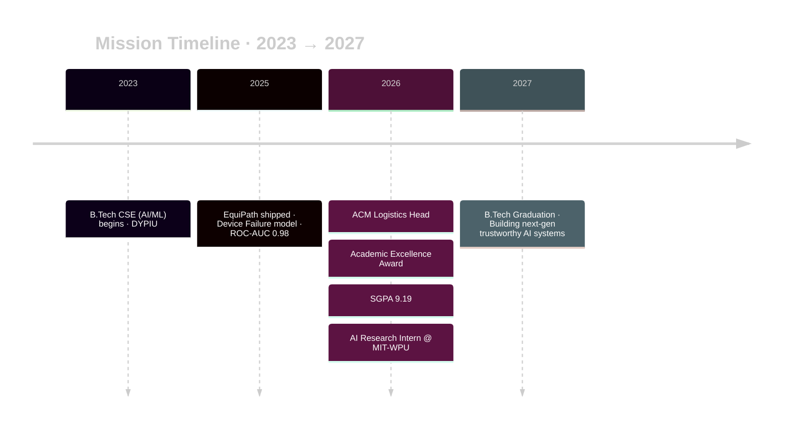

<!--
╔══════════════════════════════════════════════════════════════╗
║ SETUP                                                         ║
║ 1. Repo must be named: SakshiKolhe-3095/SakshiKolhe-3095      ║
║ 2. Put /assets folder (hero.svg, divider.svg, dashboard.svg,  ║
║    architecture.svg) in repo root, next to this README.md.    ║
║    SMIL/CSS-animated, work natively on GitHub. No build step. ║
║ 3. Snake contribution graph (optional): add                   ║
║    .github/workflows/snake.yml — generates output branch.     ║
╚══════════════════════════════════════════════════════════════╝
-->

<div align="center">



<a href="https://github.com/SakshiKolhe-3095">

</a>

<br/>

[](https://github.com/SakshiKolhe-3095)
[](https://github.com/SakshiKolhe-3095?tab=followers)
[](mailto:sakshikolhe309@gmail.com)

<br/>

<a href="mailto:sakshikolhe309@gmail.com"></a>
<a href="https://linkedin.com/in/sakshikolhe309"></a>
<a href="https://github.com/SakshiKolhe-3095"></a>

<br/><br/>

> **"Designing intelligence that is not just accurate — but fair, explainable, and deployable."**
>
> 📍 Pune, Maharashtra &nbsp;|&nbsp; 🎓 B.Tech CSE (AI/ML) · SGPA 9.19 &nbsp;|&nbsp; 🏆 Academic Excellence Award 2026

</div>


<!-- ═══════════ SYSTEM INITIALIZATION ═══════════ -->
<div align="center">

## ⚙️ &nbsp; S Y S T E M &nbsp; I N I T I A L I Z A T I O N

</div>

```python
class SakshiKolhe:
    """
    AI Engineer building intelligent systems that are accurate,
    fair, explainable, and deployable in the real world.
    """

    identity = ["AI Engineer", "AI Research Intern @ MIT-WPU", "Full Stack Developer", "Agentic AI Builder"]
    university = "D Y Patil International University"
    sgpa = 9.19

    active_modules = [
        "Responsible AI Governance",
        "Explainable AI",
        "Agentic AI Architectures",
        "Computer Vision & Video Processing",
        "AI Governance Systems",
    ]

    mission = "Build trustworthy, deployable, real-world intelligent systems."
    status  = "🟢 ACTIVE"
```

<div align="center">
<table>
<tr>
<td align="center" width="220"><br/><b>🏆 Excellence Award</b><br/><sub>DYPIU · 2026</sub></td>
<td align="center" width="220"><br/><b>📈 SGPA 9.19</b><br/><sub>Top Academic Performance</sub></td>
<td align="center" width="220"><br/><b>🎯 ROC-AUC 0.98</b><br/><sub>Calibrated ML Pipeline</sub></td>
<td align="center" width="220"><br/><b>🧠 IoU 0.7533</b><br/><sub>Attention U-Net</sub></td>
</tr>
</table>
</div>


<!-- ═══════════ AI CORE STATUS / DASHBOARD ═══════════ -->
<div align="center">

## 🖥️ &nbsp; A I &nbsp; C O R E &nbsp; S T A T U S



</div>


<!-- ═══════════ RESEARCH LAB / ARCHITECTURE ═══════════ -->
<div align="center">

## 🔬 &nbsp; R E S E A R C H &nbsp; L A B &nbsp; — &nbsp; S Y S T E M &nbsp; A R C H I T E C T U R E

*How a model goes from raw data to a governed, deployed system.*

```mermaid
%%{init: {'theme':'dark','themeVariables':{'primaryColor':'#0a0015','primaryTextColor':'#22d3ee','primaryBorderColor':'#a855f7','lineColor':'#a855f7','fontSize':'14px'}}}%%
graph LR
    A[⚖️ EquiPath<br/>Fairness Governance] -- "bias mitigation core" --> M{{🧠 Responsible AI<br/>Engineering}}
    B[🏠 Device Failure Prediction<br/>ROC-AUC 0.98] -- "production ML pipeline" --> M
    C[🫁 Attention U-Net<br/>Medical Imaging] -- "explainable vision" --> M
    D[📦 Inventory System<br/>MERN] -- "full-stack delivery" --> M
    M --> Z((🚀 Trustworthy<br/>Deployable AI))

    style M fill:#0a0015,stroke:#22d3ee,stroke-width:2.5px
    style Z fill:#0a0015,stroke:#a855f7,stroke-width:3px
```



</div>




<!-- ═══════════ INTELLIGENCE STACK ═══════════ -->
<div align="center">

## ⚔️ &nbsp; I N T E L L I G E N C E &nbsp; S T A C K

</div>

<details open>
<summary><b>🧠 &nbsp; AI / ML / Deep Learning</b></summary><br/>


</details>

<details open>
<summary><b>🤖 &nbsp; LLM & Agentic AI</b></summary><br/>


</details>

<details>
<summary><b>💻 &nbsp; Full Stack Development</b></summary><br/>


</details>

<details>
<summary><b>⚙️ &nbsp; Languages & Tools</b></summary><br/>


</details>


<!-- ═══════════ ACTIVE MISSIONS / PROJECT ECOSYSTEM ═══════════ -->
<div align="center">

## 🚀 &nbsp; A C T I V E &nbsp; M I S S I O N S

*Click a mission log to expand.*

</div>

<details open>
<summary><b>⚖️ &nbsp; MISSION 01 — EquiPath: Responsible AI Governance Platform</b></summary>

> *Enterprise-grade fairness engine with explainability, drift monitoring, and compliance auditing.*

<table>
<tr>
<td width="60%">

**Build:** Full-stack Responsible AI governance OS — fairness-aware inference pipelines, demographic bias mitigation, SHAP explainability dashboards, live governance telemetry for financial approval systems.

**Result Log:**
- ⚖️ Disparate Impact improved **0.31 → 0.81**
- 🧠 Demographic Parity + Equalized Odds auditing
- 📊 Real-time explainability + compliance dashboard
- 🚀 Production React + FastAPI microservice architecture

</td>
<td width="40%" align="center">


<br/>**Status:** 🟢 Production Ready<br/>
[](https://github.com/SakshiKolhe-3095/equipath)

</td>
</tr>
</table>
</details>

<details>
<summary><b>🏠 &nbsp; MISSION 02 — Predictive AI for Home Device Failure</b></summary>

> *ROC-AUC 0.98. Calibrated probabilities. Production deployment.*

<table>
<tr>
<td width="60%">

**Build:** XGBoost + SMOTE oversampling + probability calibration + threshold tuning on 10K+ records, deployed as real-time and batch Streamlit UI.

**Result Log:**
- 🎯 ROC-AUC ≈ **0.98**
- 📦 Dataset: **10,000+ records**
- 🔁 Real-time AND batch inference modes

</td>
<td width="40%" align="center">


<br/>**Status:** 🟢 Deployed<br/>
[](https://github.com/SakshiKolhe-3095/device-failure-prediction)

</td>
</tr>
</table>
</details>

<details>
<summary><b>🫁 &nbsp; MISSION 03 — Attention U-Net for Lung Segmentation</b></summary>

> *Region-focused medical imaging segmentation with explainable attention maps.*

<table>
<tr>
<td width="60%">

**Build:** Attention U-Net with attention gates, augmentation strategies, tf.data optimization for chest X-ray segmentation.

**Result Log:**
- 🧠 Validation IoU ≈ **0.7533**
- 🎯 Dice Score ≈ **0.7794**
- 📈 Outperformed baseline U-Net (IoU ≈ 0.7368)

</td>
<td width="40%" align="center">


<br/>**Status:** 🟢 Deployed<br/>
[](https://github.com/SakshiKolhe-3095/Attention-Based-Organ-Boundary-Detection)

</td>
</tr>
</table>
</details>

<details>
<summary><b>📦 &nbsp; MISSION 04 — Inventory Management System</b></summary>

> *Production-ready MERN platform for inventory automation.*

<table>
<tr>
<td width="60%">

**Build:** Real-time stock monitoring, low-stock alerts, JWT auth, modular REST API architecture.

**Result Log:**
- 📦 Complete CRUD inventory lifecycle
- 🔐 JWT auth + bcrypt encryption
- 📊 Real-time stock tracking with automated alerts

</td>
<td width="40%" align="center">


<br/>**Status:** 🟢 Production Ready<br/>
[](https://github.com/SakshiKolhe-3095/Inventory_Management_System)

</td>
</tr>
</table>
</details>


<!-- ═══════════ ACHIEVEMENTS ═══════════ -->
<div align="center">

## 🏆 &nbsp; A C H I E V E M E N T S &nbsp; L O G

| 🏅 | Achievement | Organization | Year |
|:---:|:---|:---|:---:|
| 🥇 | **Academic Excellence Award** | DYPIU | 2026 |
| 📈 | **SGPA 9.19** | DYPIU | 2026 |
| 🔬 | **AI Research Intern** | MIT-WPU | 2026 |
| ⚡ | **ACM Logistics Head** | ACM Utkarsh Chapter | 2026 |

</div>


<!-- ═══════════ CAREER TRAJECTORY ═══════════ -->
<div align="center">

## 🛰️ &nbsp; C A R E E R &nbsp; T R A J E C T O R Y

</div>




<!-- ═══════════ LIVE TELEMETRY ═══════════ -->
<div align="center">

## 📡 &nbsp; L I V E &nbsp; T E L E M E T R Y


<br/><br/>


<br/><br/>


</div>


<!-- ═══════════ COLLABORATION PROTOCOL ═══════════ -->
<div align="center">

## 🤝 &nbsp; C O L L A B O R A T I O N &nbsp; P R O T O C O L

**🚀 Currently Building**
Responsible AI governance &nbsp;•&nbsp; Fairness-aware ML &nbsp;•&nbsp; Computer vision systems &nbsp;•&nbsp; Agentic AI workflows

**📚 Currently Learning**
MLOps & CI/CD &nbsp;•&nbsp; Reinforcement Learning &nbsp;•&nbsp; Production AI monitoring

**📡 Open Channel**

<a href="mailto:sakshikolhe309@gmail.com"></a>
<a href="https://linkedin.com/in/sakshikolhe309"></a>
<a href="https://github.com/SakshiKolhe-3095"></a>

<br/><br/>

AI/ML Internships &nbsp;•&nbsp; Research Collaborations &nbsp;•&nbsp; Hackathons &nbsp;•&nbsp; Open Source

<br/>


</div>

<!-- README crafted as AI Command Center — SMIL-animated SVGs, no external deps -->
